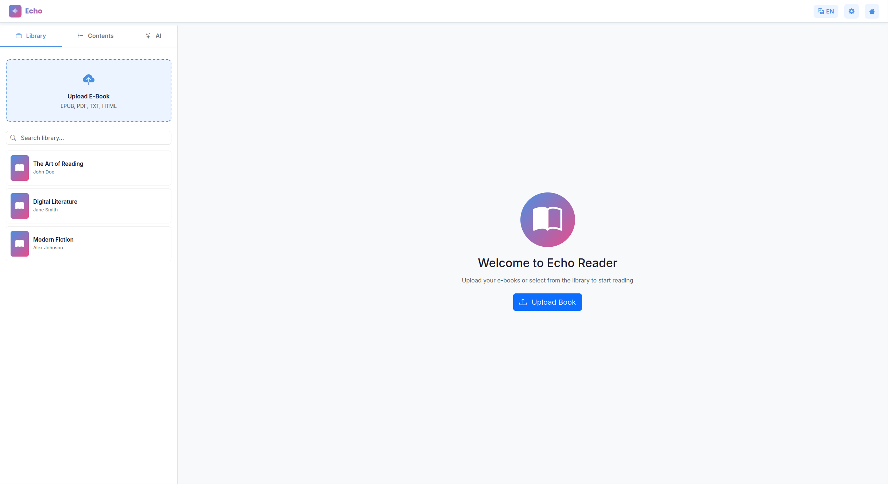

# Echo 电子书阅读器

基于 Web 的现代电子书阅读器，集成 AI 总结与交互助手，支持多格式阅读与沉浸式阅读体验。

【[English Version](README_EN.md) | 中文版本】

**主要功能**

> 💡 提示：点击下方功能标题可展开查看详细说明

<details>
<summary><b>1. 书库与格式支持</b></summary>

支持多种常见格式与便捷管理能力。

**功能特点：**
- 支持 EPUB、PDF、TXT、HTML
- 拖拽/多选上传、本地快速预览
- 书库搜索与快速定位
- 目录（TOC）侧栏导航

</details>

<details>
<summary><b>2. 阅读体验</b></summary>

提供多种个性化阅读配置，沉浸式体验。

**阅读选项：**
- 主题/字体/字号/行距/版心布局
- 深浅色模式切换
- 进度记忆，自动续读
- 界面语言一键切换（EN/中文）

</details>

<details>
<summary><b>3. AI 助手</b></summary>

基于后端 FastAPI 与 DeepSeek API 提供智能能力。

**AI 能力：**
- 全书总结、章节总结
- 内容要点与风格分析
- 书内问答聊天与单次问答
- 支持中英文处理

</details>

<details>
<summary><b>4. 后端与接口</b></summary>

统一后端服务与清晰的 API 设计。

**技术要点：**
- FastAPI 统一后端（`backend/unified_backend.py`）
- `/docs` 提供交互式接口文档
- 内存解析 EPUB，支持表单上传
- 跨平台启动脚本（Windows/macOS/Linux）

**核心接口：**
```
GET  /                  # 健康检查
POST /api/upload-book   # 上传书籍进行解析/分析
POST /api/book-summary  # 生成全书总结
POST /api/chapter-summaries  # 章节总结
POST /api/content-analysis   # 内容分析
POST /api/chat          # 书内问答聊天
POST /api/ask-question  # 单次问答
```

</details>

<details>
<summary><b>5. 性能与兼容</b></summary>

**特性：**
- 前端纯浏览器运行，部署简单
- 兼容 Windows / macOS / Linux
- 提供日志输出：`backend.log`、`frontend.log`

</details>

## 效果展示

| | |
|---|---|
|  |  |
|  |  |

## 1. 快速开始

### 1.1. 环境要求

- Python 3.8+
- 现代浏览器
- 可用网络（AI 功能需访问 DeepSeek API）

### 1.2. 一键启动（推荐）

首次使用请先配置 API Key：

```
cp .env.example .env   # 复制环境变量模板
# 编辑 .env，设置 DEEPSEEK_API_KEY=你的密钥
```

然后：

```bash
# macOS/Linux
./startup.sh

# Windows
startup.bat
```

启动后：
- 前端：http://localhost:8080
- 后端：http://localhost:8000（API 文档 /docs）

停止服务：

```bash
# macOS/Linux
./stop.sh

# Windows
stop.bat
```

### 1.3. 手动启动（可选）

```bash
# 仅启动后端（项目根目录）
./start_backend.sh

# 启动前端本地服务
cd frontend && python -m http.server 8080
```

## 2. 架构

采用前后端分离与模块化设计，便于扩展与维护。

### 2.1. 核心模块

<details>
<summary><b>backend/unified_backend.py - 统一后端</b></summary>

**功能：** EPUB 上传与解析、AI 总结/分析、对话接口。

**端口与环境：**
- 默认端口：`8000`
- 环境变量：`DEEPSEEK_API_KEY`、`BACKEND_PORT`（可选）

</details>

<details>
<summary><b>frontend/reader.html / reader.js / reader-style.css</b></summary>

**功能：** 阅读器界面、书库、目录面板、AI 面板与多语言切换。

**特性：**
- 拖拽/选择文件导入
- 章节目录与定位
- 主题与排版设置

</details>

<details>
<summary><b>frontend/ai-service.js - AI 服务调用</b></summary>

**功能：** 与后端 API 交互（总结、分析、问答等）。

</details>

<details>
<summary><b>脚本与配置</b></summary>

`startup.sh|.bat`、`stop.sh|.bat`、`start_backend.sh` 提供一键启动与停止；`.env` 管理 API Key 与端口配置。

</details>

### 2.2. 项目结构

```
e-book-reader/
├── frontend/          # 前端界面（阅读器、书库、AI 面板）
├── backend/           # FastAPI 后端（unified_backend.py）
├── documentation/     # 详细文档与指南
├── pictures/          # README 截图
├── startup.sh|.bat    # 同时启动前后端
├── stop.sh|.bat       # 停止服务
└── start_backend.sh   # 仅启动后端
```

## 3. 开发与贡献

### 3.1. 开发环境搭建

```bash
python -m venv venv
source venv/bin/activate  # Windows 使用 venv\Scripts\activate
pip install -r requirements.txt
```

### 3.2. 运行与调试

```bash
# 启动后端
./start_backend.sh

# 启动前端（另开终端）
cd frontend && python -m http.server 8080

# 访问地址
http://localhost:8080
```

### 3.3. 贡献指南

欢迎通过 Issue 与 Pull Request 参与贡献：
- 功能改进与性能优化
- Bug 修复与文档完善
- 使用示例与测试补充

## 🙏 致谢与说明

- 感谢 FastAPI、OpenAI/DeepSeek 生态与前端社区的优秀开源成果。
- 本项目集成 DeepSeek API，请遵守其服务条款，并在 `.env` 中正确配置 `DEEPSEEK_API_KEY`。

---

版本：v1.0  
更新时间：2025  
许可证：MIT
