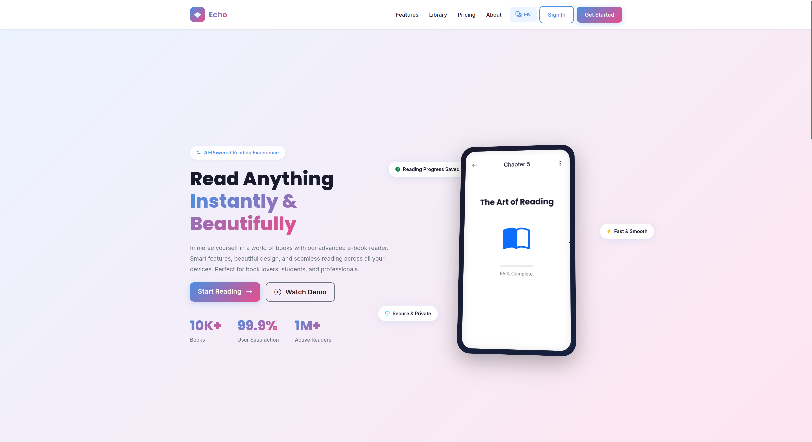
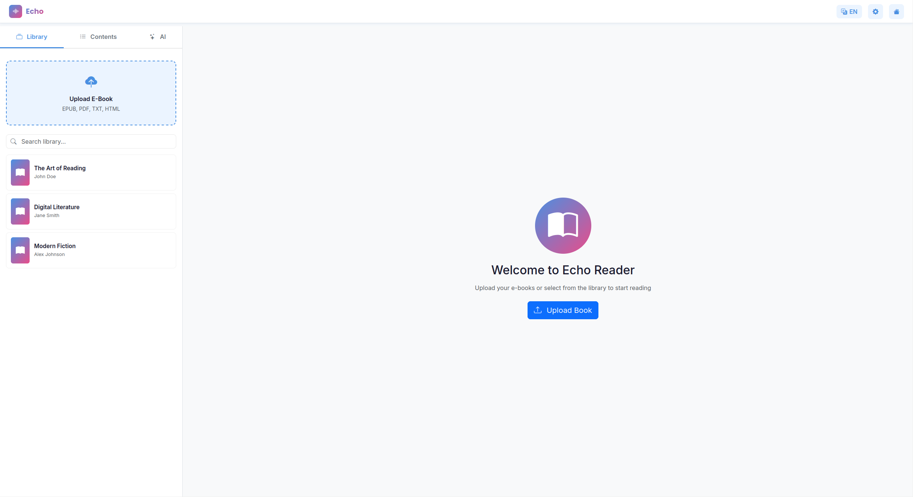

# Echo E‑Book Reader

A modern, web‑based e‑book reader with AI‑powered summaries, analysis, and an interactive reading assistant. Supports multiple formats and an immersive, customizable reading experience.

【English Version | [中文版本](README.md)】

**Key Features**

> Tip: Click the titles below to expand details

<details>
<summary><b>1. Library & Format Support</b></summary>

Organize, search, and preview books quickly.

**Highlights:**
- Formats: EPUB, PDF, TXT, HTML
- Drag‑and‑drop / multi‑file upload
- Library search and quick locate
- Table of Contents (TOC) sidebar

</details>

<details>
<summary><b>2. Reading Experience</b></summary>

Personalize your reading for comfort and focus.

**Reading options:**
- Themes, fonts, size, line height, layout
- Light/Dark modes
- Progress memory to continue where you left off
- One‑click UI language toggle (EN/中文)

</details>

<details>
<summary><b>3. AI Assistant</b></summary>

Powered by a FastAPI backend and DeepSeek API.

**AI capabilities:**
- Full‑book summaries and chapter summaries
- Key point and style analysis
- In‑book Q&A chat and single‑shot questions
- English and Chinese supported

</details>

<details>
<summary><b>4. Backend & API</b></summary>

A unified backend with clear API endpoints.

**Tech notes:**
- FastAPI unified backend (`backend/unified_backend.py`)
- Interactive docs at `/docs`
- In‑memory EPUB parsing via form upload
- Cross‑platform startup scripts (Windows/macOS/Linux)

**Core endpoints:**
```
GET  /                      # Health check
POST /api/upload-book       # Upload and parse/analyze book
POST /api/book-summary      # Full book summary
POST /api/chapter-summaries # Chapter summaries
POST /api/content-analysis  # Content analysis
POST /api/chat              # In‑book Q&A chat
POST /api/ask-question      # One‑off question
```

</details>

<details>
<summary><b>5. Performance & Compatibility</b></summary>

**Highlights:**
- Frontend runs fully in the browser
- Works on Windows / macOS / Linux
- Logs available: `backend.log`, `frontend.log`

</details>

## Showcase

| | |
|---|---|
|  |  |
|  |  |

## 1. Quick Start

### 1.1. Requirements

- Python 3.8+
- Modern web browser
- Internet access (for AI features via DeepSeek API)

### 1.2. One‑click Startup (Recommended)

First, configure your API key:

```
cp .env.example .env   # Create your environment file
# Edit .env and set DEEPSEEK_API_KEY=your_key
```

Then start:

```bash
# macOS/Linux
./startup.sh

# Windows
startup.bat
```

After startup:
- Frontend: http://localhost:8080
- Backend:  http://localhost:8000 (API docs at /docs)

Stop services:

```bash
# macOS/Linux
./stop.sh

# Windows
stop.bat
```

### 1.3. Manual Startup (Optional)

```bash
# Serve the frontend
cd frontend && python -m http.server 8080
```

## 2. Architecture

Modular, front‑end/back‑end separation for easy maintenance and extension.

### 2.1. Core Modules

<details>
<summary><b>backend/unified_backend.py — Unified Backend</b></summary>

**Functions:** EPUB upload & parsing, AI summary/analysis, chat endpoints.

**Ports & env:**
- Default port: `8000`
- Env variables: `DEEPSEEK_API_KEY`, `BACKEND_PORT` (optional)

</details>

<details>
<summary><b>frontend/reader.html / reader.js / reader-style.css</b></summary>

**Functions:** Reader UI, library, TOC panel, AI panel, language toggle.

**Highlights:**
- Drag‑and‑drop / file picker import
- Chapter TOC and navigation
- Theme and layout customization

</details>

<details>
<summary><b>frontend/ai-service.js — AI Service Client</b></summary>

**Functions:** Interacts with backend AI endpoints (summary, analysis, Q&A).

</details>

<details>
<summary><b>Scripts & Config</b></summary>

`startup.sh|.bat`, `stop.sh|.bat`, `start_backend.sh` provide one‑click start/stop; `.env` manages API keys and ports.

</details>

### 2.2. Project Structure

```
e-book-reader/
├── frontend/          # Web interface (reader UI, library, AI panel)
├── backend/           # FastAPI backend (unified_backend.py)
├── documentation/     # Detailed docs and guides
├── pictures/          # Screenshots used in README
├── startup.sh|.bat    # Start frontend + backend
├── stop.sh|.bat       # Stop services
└── start_backend.sh   # Start backend only
```

## 3. Development & Contributing

### 3.1. Dev Environment

```bash
python -m venv venv
source venv/bin/activate  # On Windows use venv\Scripts\activate
pip install -r requirements.txt
```

### 3.2. Run & Debug

```bash
# Start backend
./start_backend.sh

# Start frontend (in another terminal)
cd frontend && python -m http.server 8080

# Visit
http://localhost:8080
```

### 3.3. Contributing

We welcome Issues and Pull Requests:
- Feature improvements and performance tuning
- Bug fixes and documentation enhancements
- Examples and tests

## 🙏 Acknowledgements & Notes

- Thanks to the FastAPI, OpenAI/DeepSeek ecosystems, and the frontend community.
- This project integrates the DeepSeek API. Please comply with their Terms of Service and set `DEEPSEEK_API_KEY` in your `.env`.

---

Version: v1.0  
Updated: 2025  
License: MIT

